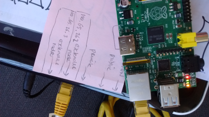
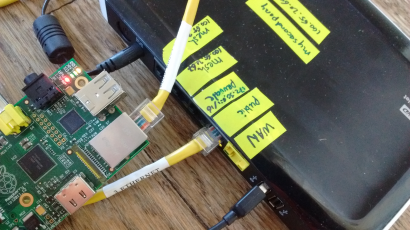

# Sudo Mesh Service Setup Guide 

This guide is intended to help mesh node operators to:
* decide what service might work well on a mesh network
* implement their service
* make their service accessible on the mesh (and the Internet?)
* maintain their service
* teach others to set up services

## So you want to put a service on the mesh...
Maybe you just became a node on a mesh network, or maybe you'd like to learn more about how services work on a mesh. Whatever the case, you probably have a great idea for a service that could run on a distributed network. However, the first step is learn the concepts of meshing by building your own node.

## build a mesh node
To host a service on a mesh, you must first be a node on said mesh. A mesh node can be almost any laptop, server, raspberry pi, or home router. To be part of a mesh, a device must be capable of three tasks:
* running a mesh routing protocol (e.g. babel-d)
* obtaining a mesh IP address (either statically from a server or via a distributed method, such mDNS)
* digging a tunnel to the exit node (assuming that you'd like to connect to the world outside the mesh, or have only virtual connections to the mesh)

### running babeld 
babeld is how mesh nodes say hi, talk to one another, tell eachother about their neighbors. A great place to start learning about babel-d is our [babeld-lab](https://github.com/sudomesh/babeld-lab).

### getting a mesh IP
Currently sudomesh uses a centralized database to manage IP address assignment, ensuring that there are no duplicate IPs handed out. This is a temporary solution until a distributed one is developed. Use [makenode](https://github.com/sudomesh/makenode) to get a sudomesh IP or figure out how to deploy your own [meshnode database](https://github.com/sudomesh/meshnode-database).

### digging a tunnel
Even if you do not have a physical connection to the mesh, you can still be part of the mesh. By digging a tunnel through a VPN to the exit node, your mesh node can be connected to every other mesh node. It also functions as a way to connect to the broader internet. sudomesh uses the [tunneldigger](https://github.com/wlanslovenija/tunneldigger) developed by wlanslovenija. Check out our [tunneldigger-lab](https://github.com/sudomesh/tunneldigger-lab) to get started.


# Use Case - Raspberry Pi as wired mesh node via home node.

## ingredients

1 home node

1 raspberry pi running raspian with ssh enabled (see https://www.raspberrypi.org/documentation/remote-access/ssh/)

1 computer connected to home node via peoplesopen.net ssid

1 human that is somewhat familiar with linux on commandline .

the use case assumed your computer is running ubuntu compatible flavor.

## steps

1. figure out the home node ip by running ```ip route``` on the commandline. You should see something like :

```
$ ip route
default via 100.65.xx.xx dev wlp3s0  proto static  metric 600 
...
```

The first number 100.65.xx.xx is the ip address of your router on the mesh. 

2. connect the raspberry pi to the private port of the router (on MyNet N600, this is the third port from the power button)


3. login to the router using ```ssh root@[ip home node]``` and provide password specified when flashing/ configuring the home node. This should look something like:

```
$ ssh root@100.65.xx.xx
root@100.65.xx.xx's password: 

BusyBox v1.23.2 (2017-11-21 21:45:39 UTC) built-in shell (ash)

... some banner ...
root@xx:~#
```

4. figure out your static mesh ip addresses. The home node comes with two extra mesh ip addresses. Normally, you'd use them for extender nodes. However, now, we are using one of them for the raspberry pi to get into the mesh. The available static mesh ip addresses are the home node ip address, lets say 100.65.20.65, with the last number added one and two: 100.65.20.66 and 100.65.20.67 . You can double check this by running the following on the home node:

```
# cat /etc/config/notdhcpserver 
config server
  option enabled '1'
  list addresses 'eth0.1=100.65.20.66/26'
  list addresses 'eth0.2=100.65.20.67/26'
  option hook_script '/opt/notdhcpserver/hook.sh'
  option ssl_cert '/etc/uhttpd.crt'
  option ssl_key '/etc/uhttpd.key'
  option timeout_length '180'
```

where eth0.1 and eth0.2 contains the two static ip addresses.

5. after logging into the home node, figure out the ip address of the raspberrypi by running ```cat /tmp/dhcp.leases``` producing something like:

```
root@xx:~# cat /tmp/dhcp.leases 
...
... [pi ip address] raspberrypi *
...
```

The number sequence preceding the raspberrypi word is the (private) ip address given by the router dhcp to the raspberry pi. 

6. ssh into raspberry pi by using ```sudo pi@[pi ip address]``` and providing password (default: raspberry)

7. set static mesh ip address on raspberry pi by ```sudo nano /etc/dhcpcd.conf``` and adding section:

```
interface eth0
static ip_address=100.65.20.66/32
static routers=100.65.20.65
static domain_name_servers=100.65.20.65 100.64.0.42 
```

where ip_address is the static mesh ip, routers is the mesh ip of your home node, and domain_name_servers include the route node ip and the mesh nameserver at 100.64.0.42 .

8. shutdown your pi by running ```sudo shutdown now``` and unplug from the home node private port.

9. plug pi into the second mesh port (confirmed to work with MyNet N600 that meshes with another home node to get route to internet ), disconnect the power supply and power back on. Note that for some reason, this approach doesn't work with the second mesh node, if this is the case, use the public port, the port next to the yellow colored ethernet port (confirmed to work with MyNet N750 bridge to WAN via hotspot, )

10. ssh into pi by running ```ssh pi@[pi mesh ip address]``` on your laptop or router.

11. if all works well, the mesh is yours to serve to from your pi. 
